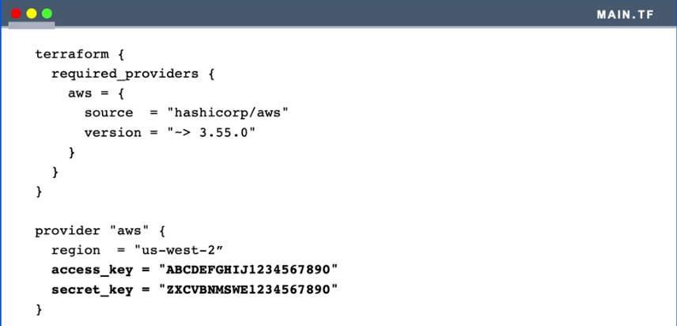
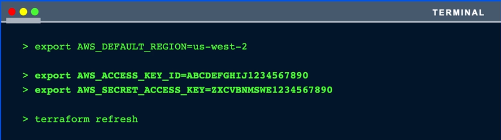
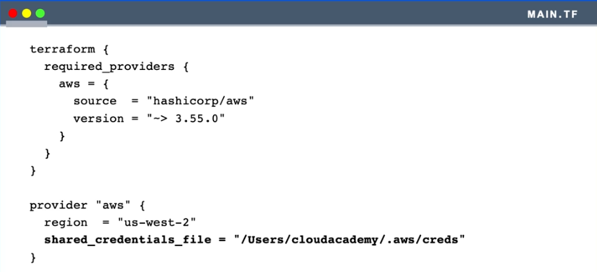
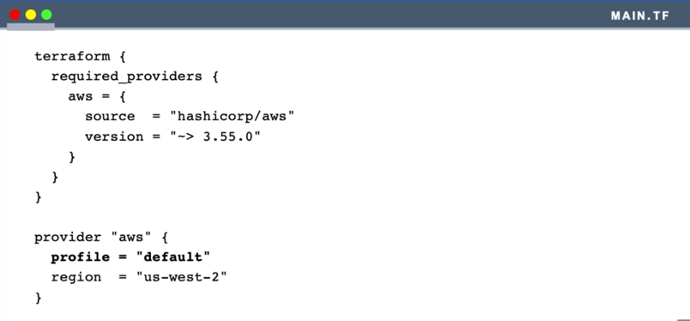

# [Terraform Associate Certification Exam Preparation](https://cloudacademy.com/learning-paths/terraform-associate-certification-exam-preparation-1-2814/)

[CA GitHub](https://github.com/cloudacademy/terraform-aws) 

### 1. AWS Authetication Config
There are three approaches,

**Approach 1**: 
  - Write the credentials directly into terraform template file
  - This is a BAD practice
    

**Approach 2**: 
  - Use environmental variables
    
    
**Approach 3**: 
  - Use shared credentials file from the local system
    

  - In case you you want to use the aws profile
    


### 2. Terraform CLI Subcommands

Commonly used commands / primary workflow commands 
```
$ terraform -help
Usage: terraform [global options] <subcommand> [args]

The available commands for execution are listed below.
The primary workflow commands are given first, followed by
less common or more advanced commands.

Main commands:
  init          Prepare your working directory for other commands
  validate      Check whether the configuration is valid
  plan          Show changes required by the current configuration
  apply         Create or update infrastructure
  destroy       Destroy previously-created infrastructure
```

Advanced commands
```
$ terraform -help

All other commands:
  console       Try Terraform expressions at an interactive command prompt
  fmt           Reformat your configuration in the standard style
  force-unlock  Release a stuck lock on the current workspace
  get           Install or upgrade remote Terraform modules
  graph         Generate a Graphviz graph of the steps in an operation
  import        Associate existing infrastructure with a Terraform resource
  login         Obtain and save credentials for a remote host
  logout        Remove locally-stored credentials for a remote host
  metadata      Metadata related commands
  output        Show output values from your root module
  providers     Show the providers required for this configuration
  refresh       Update the state to match remote systems
  show          Show the current state or a saved plan
  state         Advanced state management
  taint         Mark a resource instance as not fully functional
  test          Experimental support for module integration testing
  untaint       Remove the 'tainted' state from a resource instance
  version       Show the current Terraform version
  workspace     Workspace management
```

### 3. Syntax

Hashicorp Configuration Language (HCL)

#### [3.1 Comments Syntax](https://developer.hashicorp.com/terraform/language/syntax/configuration#comments)

The Terraform language supports three different syntaxes for comments:

- `#` begins a single-line comment, ending at the end of the line.

- `//` also begins a single-line comment, as an alternative to `#`.

- `/*` and `*/` are start and end delimiters for a comment that might span over multiple lines.

The `#` single-line comment style is the default comment style and should be used in most cases. Automatic configuration formatting tools may automatically transform `//` comments into `#` comments, since the double-slash style is not idiomatic.

#### [3.2 Escape Sequences](https://developer.hashicorp.com/terraform/language/expressions/strings#escape-sequences)

| Sequence     | Replacement                                                                   |
| ------------ | ----------------------------------------------------------------------------- |
| `\n`         | Newline                                                                       |
| `\r`         | Carriage Return                                                               |
| `\t`         | Tab                                                                           |
| `\"`         | Literal quote (without terminating the string)                                |
| `\\`         | Literal backslash                                                             |
| `\uNNNN`     | Unicode character from the basic multilingual plane (NNNN is four hex digits) |
| `\UNNNNNNNN` | Unicode character from supplementary planes (NNNNNNNN is eight hex digits)    |

#### [3.3 String Templates](https://developer.hashicorp.com/terraform/language/expressions/strings#string-templates)

[Interpolation](https://developer.hashicorp.com/terraform/language/expressions/strings#interpolation) : 

A `${ ... }` sequence is an interpolation, which evaluates the expression given between the markers, converts the result to a string if necessary, and then inserts it into the final string:
```
"Hello, ${var.name}!"
```

[Multi-line string](https://developer.hashicorp.com/terraform/language/expressions/strings#indented-heredocs) :

The standard heredoc form,
```sh
block {
  value = <<EOT
hello
world
EOT
}
```
Indented heredoc string variant that is introduced by the <<- sequence,
```sh
block {
  value = <<-EOT
  hello
    world
  EOT
}
```

